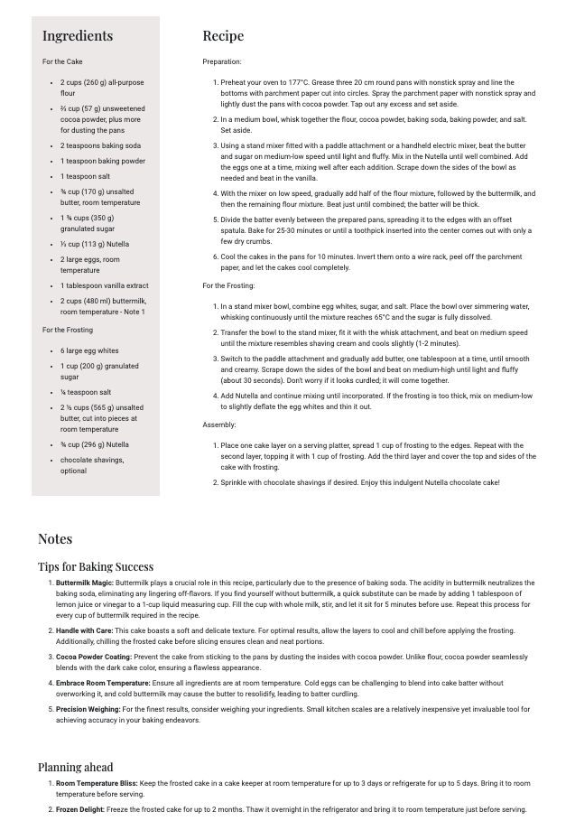
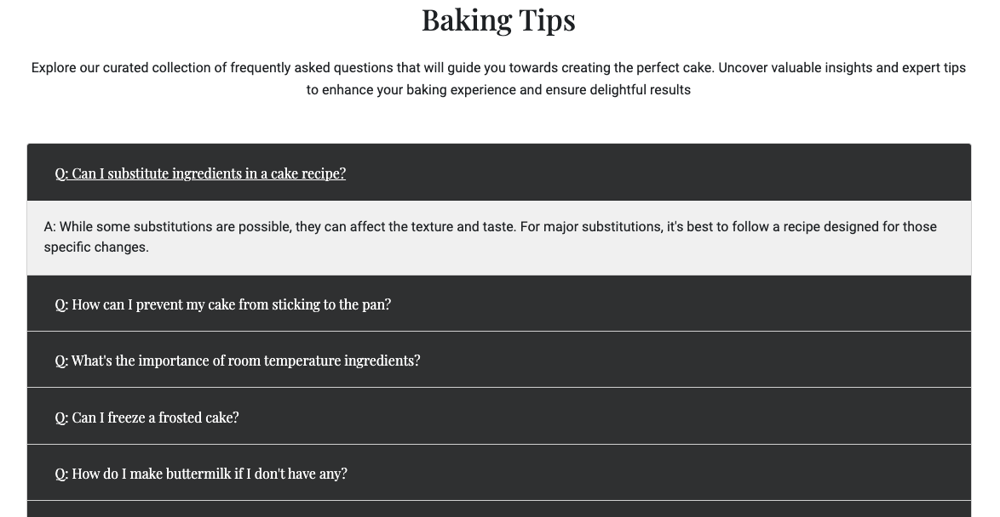
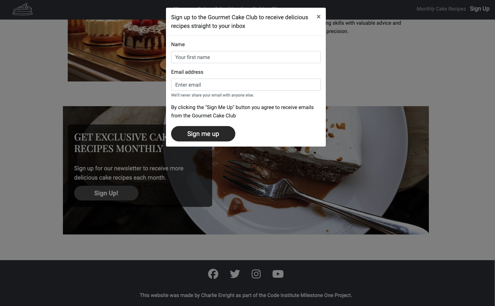

# The Gourmet Cake Club

The Gourmet Cake Club provides a go-to destination for an exquisite assortment of beautifully crafted cakes. Explore our monthly feature, the "Cake of the Month," which features a delightful cake with detailed recipes and ingredients for a tempting experience. If you're hungry for more, sign up to receive additional sweet surprises directly to your inbox. Explore our "Baking Tips" section to find answers to common cake-making queries. Join us in celebrating the art of baking with each visit.

Visit Gourmet Cake Clubs website here [The Gourmet Cake Club](https://enrightc.github.io/Gourmet-Cake-Club-Website/)

## Overall Website Aim

The primary aim of the Gourmet Cake Club website is to delight cake enthusiasts with an exquisite collection of high-end, visually stunning cakes, providing a sophisticated platform for discovering and indulging. Each month a new "Cake of the Month" will be added where visitors will be able to find the cake recipe and ingredients. In addition to this visitors will be able to find a "Baking Tips" page that answers some of the common questions people have when baking cakes.

## External User Goals

- Discover Delicious Recipes: Users will want to explore a variety of cake recipes, including the unique “Cake of the month”
- Learn Baking Techniques: Through the "Baking Tips"" section users can acquire baking tips and techniques to improve their cakes.
- Access Cake of the Month Features: Users are excited to discover and potentially try the featured Cake of the Month.
- Sign-Up: Users can sign up to the monthly newsletter to receive more cake recipes straight to their inbox.

## Website Owners Goals

- Generate Newsletter Subscriptions: The site owner wants users to sign up for a newsletter or subscription to receive monthly cake recipes.
- Showcase Cake Expertise: The site aims to establish itself as a go-to source for cake-related information, showcasing the owner's expertise.
- Increase Website Traffic: The site owner desires increased traffic to the website through engaging content and marketing efforts.
- Encourage Social Media Sharing: The owner hopes users will share their favourite recipes, blog posts, or Cake of the Month features on social media, contributing to the website's visibility.
  
- ## User Story
- First-time User

  - As a first-time user, I want to quickly grasp the essence of the Gourmet  Cake Club and understand how it caters to cake enthusiasts with its high-end and visually stunning cakes.
  - As a first-time user, I aim to navigate the website effortlessly, ensuring a positive and enjoyable experience while exploring the exquisite cake collection.
  - As a first-time user, I want to freely browse through the cake recipes and baking tips without the need to sign up, allowing me to sample the content before committing.
  
- Returning User

    - As a returning user, I want to easily find the featured Cake of the Month that aligns with my taste, providing a delightful experience as I discover new and exciting recipes.
    - As a returning user, I seek clear and concise instructions for each cake recipe, including details about the ingredients and baking techniques, enhancing my baking skills.

- Frequent User
    - As a frequent user, I want the option to sign up for the Gourmet Cake Club newsletter, ensuring I stay informed about new cake recipes added to the collection.
    - As a frequent user, I aspire to contribute my favorite cake recipes or baking tips, actively participating in the community and benefiting other cake enthusiasts.

# DESIGN

## Wireframes

[Homepage](docs/wireframes/index.html.png)

[Cake of the Month](docs/wireframes/cake-of-the-month.png)

[Recipes](docs/wireframes/recipes.png)

[sign-up](docs/wireframes/sign-up.png)

[Tips](docs/wireframes/tips.png)
## Imagery

The selection of imagery for the Gourmet Cake Club website is intentional and contributes to the overall aesthetic of the site. The goal is to convey an impression of elegance, professionalism, and cleanliness. To achieve this, images have been carefully selected featuring beautifully decorated cakes showcased against clean, professional, and sophisticated environments.

The consistent use of high-quality visuals aims to provide visitors with a visually pleasing and memorable experience. 

## Colors

The colour scheme of the Gourmet Cake Club website revolves around a sleek and minimalist palette. Opting for a black navigation bar atop a pristine white background, creating an atmosphere of cleanliness and simplicity throughout the site.

- **Navigation:** The navigation bar is designed in black, offering a sleek and sophisticated touch while ensuring a clutter-free environment for users to explore the website effortlessly.

- **Background:** A consistent white background is employed to enhance the sense of cleanliness and maintain a clear visual hierarchy.

- **Font Colours:** To achieve optimal readability and visual contrast, a black font is used when presented against the white background. Similarly, a white font is employed when content appears against dark backgrounds, ensuring a harmonious and polished appearance.

This deliberate choice of colours aims to create a user-friendly and aesthetically pleasing environment, allowing visitors to focus on the exquisite cake offerings and content without distractions.

## Fonts

The Gourmet Cake Club website pays careful attention to typography to enhance the overall visual appeal and readability of the content. All fonts are sourced from Google Fonts.

- **Headings:** Using the /Playfair Display' font for headings imparts a subtle and tasteful appearance, adding an elegant touch to the presentation of key information.

- **Paragraphs:** To ensure ease of reading the 'Roboto' font is used for paragraph text. This font contributes to a comfortable reading experience across various content sections.

- **Backup Font:** As a precautionary measure, the Sans Serif font is implemented as a backup. In the event that the primary fonts are not imported correctly, it will ensure a consistent and legible presentation of text throughout the website is maintained.

By combining these fonts thoughtfully it provides a cohesive and visually pleasing experience for visitors.

## Accessibility

Ensuring a positive and inclusive user experience is a priority for the Gourmet Cake Club website. Therefore design choices are guided by accessibility principles to accommodate a diverse audience.

- **Colour Contrast:** The website's primary colour scheme of black and white is intentionally selected to provide a strong contrast, enhancing readability for all users. This ensures that text and content stand out clearly against the background, promoting a visually accessible experience.

- **Font Selection:** Simplicity and readability has been prioritised in font choices. The selected fonts, including 'Playfair Display' for headings and 'Roboto' for paragraphs, are chosen for their clear and straightforward design. This enhances the overall legibility of the content for users with varying visual abilities.

By incorporating these design considerations, The Gourmet Cake Club website creates an accessible and welcoming space for all visitors to explore with ease.

## Design Feedback

The Gourmet Cake Club website has undergone thoughtful design reviews from friends and colleagues. below is some of the feedback received:

- **Clean and Tidy Design:** Reviewers have commended the website for its clean and tidy design, creating an aesthetically pleasing and organised visual experience.

- **Responsiveness:** The website has been recognised for its responsiveness, ensuring a seamless and enjoyable user experience across various devices.

- **Button Hover Effects:** The dynamic colour changes when hovering over buttons have been well-received, adding an engaging and interactive element to the user interface.

- **Smooth Q and A Accordion:** Users appreciate the smooth functionality of the Q and A accordion, noting its seamless opening and closing transitions.

- **Homepage Call to Action:** The call-to-action section on the homepage has garnered positive attention, providing an effective way to guide user interaction and engagement.

- **Tidy Layout:** The website's layout has been praised for its tidiness, contributing to an overall polished and well-organised appearance.

# FEATURES

## Existing Features:
The following information provides an overview of the features found within the website. 

### **Navigation:**
  - The website features a fully responsive navigation bar located at the top opf the website, showcasing links to 'Home,' 'Cake of the Month,' and 'Baking Tips.' Positioned at the center of the navigation bar, these links provide easy access to different sections of the website.
  - The navigation bar maintains a fixed position, ensuring visibility at the top of the page as users scroll. Adjacent to the navigation bar's left side is a discreet yet site logo, serving as a direct link to the home page.
  - On the right side of the navigation bar, a 'Sign Up' link calls users to subscribe for monthly updates. Clicking this link opens a modal where users can submit their email addresses.
  - For a seamless experience on smaller devices, the navigation bar gracefully collapses into a hamburger menu. The website logo remains on the left, and to the right, the hamburger menu icon appears. Activating the hamburger menu expands the navigation options, now including the 'Sign Up' link at the end of the list. This thoughtful design ensures easy navigation and engagement, regardless of the user's device.

Navigation bar on large devices:

Navigation bar on smaller devices:

  

### **Hero Images:**
On every page, a striking hero image takes center stage just beneath the navigation bar, immediately capturing the visitor's attention. Notably, each page features a distinct hero image carefully chosen to prevent visitor fatigue. This deliberate choice aims to create a dynamic and visually engaging experience for users, ensuring that as they navigate through various sections, they are met with fresh and relevant visuals. The use of different hero images not only adds aesthetic diversity but also serves to highlight the unique content and theme of each page, making the overall browsing experience more captivating and enjoyable.

### **Landing Page:**
- **Hero**
  - The landing page boasts a captivating hero section directly below the navigation bar. The hero features a striking background image with text overlay, elegantly presenting the website's title and tagline.

Landing page hero:

- **About**
  - Directly beneath the hero the website visitor will find a "welcome" message that provides a brief overview of the website and the content that can be found within.

- **Features**
  - Within the main body of the landing page website visitors will find sections that relate to the pages of the website ("Cake of the Month" and "Baking Tips"). Each section contains a brief description on what the user will find if they explore the pages and a "Read More" link that will direct them to the relevant page. It is intended that the "Cake of the Month" image and description will be updated each month with the new monthly cake feature. 

Welcome message and features:

 

 - **Call To Action**
  - At the bottom of the page visitirs will find a call-to-action. Clicking the sign-up button triggers the same modal as seen in the navigation bar.

Call-to-Action:

### **Cake of the Month:**
  - This page will be regularly updated with a new "Cake of the Month," whilst maintaining a consistent layout for simplicity and familiarity for returning users.
  - Below the hero section, a info box provides visitors with a quick overview detailing preparation time, servings, and the skill level required for the featured cake. Note a convenient "Jump to Recipe" button allows users to skip the cake description and head straight to the recipe and ingredients.
  - Beneath the overview box visitors will discover a cake description, image of the finished cake, a comprehensive list of ingredients, the step-by-step recipe, and any additional notes.
  - On large devices the ingredients and recipe are provided bide-by-side to allow the visitor to easily reference the content of both without the need for scrolling. 

Info box and cake description on the "Cake of the month" page (Note the "Jump to Recipe" button that allows visitors to skip past the cake description and get straight to the recipe):

Ingredients and Recipe:

### **Baking Tips Page**
  - On this page visitors can find answers to some of the most common bake ckking related questions.
  - A Bootstrap accordion component has been used to organise the conent within callapsible items. This particular accordion allows the display of one collapsed item a time. 
  - The accordion proves a user-friendly experience. Visitors can click on a question to reveal the answer.

Baking Tips Accordion:

### **Sign Up**
  - Subtly located on the right side of the navigation bar, users will consistently find a discreet yet accessible sign-up link throughout the website. This strategic placement ensures visibility without distracting users from the content.
  - In addition to the navigation bar link, a second sign-up invitation can be found in the call-to-action section at the bottom of the homepage. This reinforces the opportunity for visitors to subscribe and stay connected.
  - Clicking on either sign-up link will seamlessly open a modal, providing users with a simple and user-friendly interface. Within the modal, users are prompted to enter their name and email address, facilitating quick and seamless registration for monthly newsletters. The modal can be closed by clicking anywhere on the web page.
  - The sign-up link aims to be noticeable and easily accessible, yet unobtrusive, allowing users to engage with the content seamlessly. This thoughtful approach ensures a pleasant and non-intrusive user experience.

Sign-up Modal:

### **Footer**
  - The footer section includes links to The Gourmet Clubs social media pages (Facebook, Instagram, Twitter and Youtube).
  - The links will open in a new tab for user convenience.
  - The footer serves as a valuable resource, enabling users to effortlessly find and follow The Gourmet Cake Club across different social channels.

Footer:

## Future Website Enhancements:
 **Archive Cake Recipes**
  - As each month passes and a new monthly cake is added the previous cake of the month will be added to a recipe archive that will be maintained on an additional web page. 
  - Visitors will be able to search this archive for their favourite recipes.
  
**Build a Community**
- The website aims to create a community of cake lovers, fostering engagement and interaction among users through comment sections on recipes.

**Promote Featured Products**
- In the future, the site owner may explore opportunities to highlight and endorse specific baking products, tools, or ingredients. This could involve dedicated sections or features to showcase and promote noteworthy items that enhance the baking experience for the community.

**Users Submit Questions**
- To enhance the user experience on the "Baking Tips" page, a future feature might involve allowing site visitors to submit additional questions. This ensures that users can seek information beyond what is initially provided, creating an interactive and responsive platform for addressing specific inquiries related to baking.

**Multiple Open Answer Sections in the Accordion**
- In an effort to provide users with even greater flexibility and control, a future enhancement is considered for the question and answers accordion. The plan involves allowing users to choose to have multiple answer sections open simultaneously. This feature aims to enhance user navigation and accessibility, enabling individuals to explore and compare answers across different questions simultaneously for a more efficient and personalized experience.

# BUGS

### Fixed Bugs

#### Hero Image Rendering Issue on Mobile Devices

- Issue: The hero image does not render correctly on mobile devices, resulting in a zoomed-in view on a small section of the image.
- Description: During testing on a mobile phone display, it was observed that the hero image was not rendering as expected. The issue was identified to be related to the "fixed" value in the background property, causing the image to display incorrectly and eliminating the intended parallax effect.
- Expected Behavior: The hero image should render correctly on all devices, including mobile, without sacrificing the intended parallax effect.
- Steps to Reproduce:
  - Access the website on a mobile device.
  - Observe the rendering of the hero image, noting the zoomed-in view.
- Investigation and Solution:
  - Reviewed CSS properties for the background image.
  - Identified that the "fixed" value in the background property was causing the rendering issue.
  - Removed the "fixed" value, resolving the rendering problem but sacrificing the parallax effect.

### Known Bugs (unresolved)

#### Navigation Bar Overlaps Section Headings

- Issue: When clicking on a link to jump to a specific section of the page, the fixed navigation bar overlaps the headings of that section, making them partially or entirely hidden from view.
- Description: The fixed navigation bar does not account for the presence of section headings, causing a visual obstruction when navigating to specific sections. This affects the user experience as essential information becomes concealed, impacting the clarity of the content.
- Expected Behavior: When the user uses a link to navigate to a section of the page the section sub-headings should be visible without any overlap or obstruction from the navigation bar.
- Steps to Reproduce:
  - Navigate to any page with multiple sections.
  - Click on a link in the fixed navigation bar to jump to a specific section.
- investigation and Solution:
  - Added padding to the top of the container. Now when the user clociks the links the relevant headings are visible. 

#### Cursor Not Changing to Pointer on Safari

- Issue: On the Safari browser, when hovering over links, the cursor does not change to the expected pointer icon as it does on other browsers.
- Description: The default cursor behavior is not being observed on Safari when hovering over clickable links. Users may expect a visual cue, such as a pointer icon, to indicate a interactive link. This non-standard behavior can cause confusion and impact the perceived responsiveness of the website.
- Expected Behavior: When hovering over links, the cursor should change to a pointer icon across all browsers, providing a clear indication to users that the element is clickable.
- Steps to Reproduce:
  - Open the website on Safari.
  - Hover over any clickable link.

# Technology

## Languages Used:
- HTML
- CSS

# Frameworks, Libraries and Programs Used
- Bootstrap (version 4.1) 
  - For website design and development.
- Google Fonts 
  - For importing font styles.
- Font Awesome
  - To import social media icons.
- Squoosh
  - To reduce file size of images.
- Responsinator
  - Used to assess responsiveness of website across various device sizes.
- Figma
  - Used to create wireframe images.
- Chrome Dev Tools
  - For testing responsiveness and fine-tuning.
- Github 
  - For website hosting.
- W3C
  - Used for validating HTML and CSS.

# TESTING

# DEPLOYMENT
To launch the project, GitHub Pages was employed as the deployment platform. The deployment process involves the following steps:

- Navigate to the project repository on GitHub.com.
Click on 'Settings' located near the top of the page.
- From the menu bar on the left, choose 'Pages.'
- In the 'Source' section, pick the desired branch from the 'Branch' dropdown menu, typically the main branch.
- After making the selection, click 'Save.'
- Successful deployment will be confirmed with a message on a green background stating, "Your site is published at," followed by the corresponding web address.

# CREDITS
### Content
- Chocolate Nutella Cake recpie was sourced from [Baked by an introvert](https://www.bakedbyanintrovert.com/nutella-cake/).

### Images
- The home page hero image was obtained from [Rawpixel](https://www.rawpixel.com). These images are from the public domain collection and are free for personal and commercial use with no attirbution required.
- All other images weer created using ChatGPT DALL.E.

## Resources
- [W3Schools](https://www.w3schools.com)
- [Stack overflow](https://stackoverflow.com)
- Code Instiute learning material

### For specific tasks
- For help with position navigation links to centre of nav bar: [Stack overflow](https://stackoverflow.com/questions/19733447/bootstrap-navbar-with-left-center-or-right-aligned-items) 
[Accessed 21st Nov 2023]
- For help with Aria-labels and background images [Alternate Text for Background Images](https://www.davidmacd.com/blog/alternate-text-for-css-background-images.html)
[Accessed 7th Dec 2023]

### Acknowledgements
Many Thanks to my mentor, Antonio Rodriguez, for his help and advice. Also to Alan Busell (Code Institute), James Williams and Poppy McLaughlin for their support and kindly reviewing my website. 

